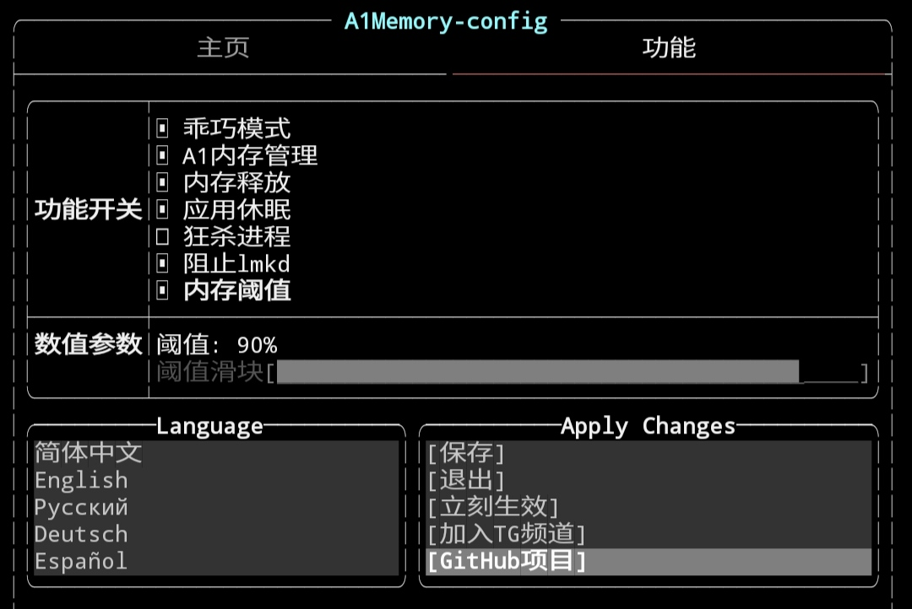

<div align="center">
<h1>Управление памятью A1</h1>
<a href="http://cppmicroservices.org/"></a>
<a href="http://cppmicroservices.org/"></a>
<a href="https://www.python.org/"></a>


<a href="https://t.me/HCha1234"></a>
<p><b><a href="README.md">English</a> | <a href="README-zh.md">简体中文</a> | <a href="README-ru.md">Русский</a></b></p>
<p>Стороннее управление памятью, работающее на Android, может уменьшить оперативную память, используемую приложениями.</p>
</div>

## ✨Важные особенности
- Управление фоновым процессом жизни и смерти
- Укажите, чтобы освободить дочерний процесс фонового приложения.
- Не позволяйте демону убийцы с низким объемом памяти убивать фон
- Автоматическое освобождение неиспользуемой памяти
- Приложения для сна, чтобы уменьшить использование процессора и памяти.

## 💡Описание
- Этот модуль поддерживает только Android8 ~ 14, а платформа поддерживает только arm64-v8a.
- Магиск не ниже 20.4+, и большинство ксу совместимы
- Этот мод не будет создавать конфликтов с другими модами

### Путь к списку по умолчанию

- Список имен: /sdcard/Android/HChai/HC_memory/名单列表.conf

## 📱Терминальный интерфейс
Настройка функции переключения, поддерживается только простое переключение функций. Для более детальной настройки параметров, пожалуйста, смотрите 📝 Пользовательские настройки.

Как получить доступ к терминальному интерфейсу?
- Вы можете использовать команду `amui` в Termux или выполнить /sdcard/Android/HChai/HC_memory/`terminal.sh` в менеджере mt.

Как сохранить и переключить функции?
- Используйте стрелки для навигации и нажмите Enter для сохранения.
- Если нет клавиатуры, нажмите на иконку "lm" в нижнем правом углу, чтобы вызвать клавиатуру.

Для чего эта функция?
- Пояснение будет добавлено в терминальный интерфейс позже. В настоящее время доступно только руководство по настройке Json.

## 📝Пользовательская конфигурация
Встроенная конфигурация подходит для большинства устройств, но есть еще некоторые устройства, которые не относятся к конфигурации по умолчанию, поэтому открывается больше встроенных настраиваемых параметров. Это требование было учтено при разработке фреймворка HAMv2.Большинство параметров можно настраивать и корректировать, а этот проект можно встраивать в другие модули для запуска. Файл конфигурации Json находится по адресу ['/data/adb/modules/Hc_memory/config/memory.json'].

### Информационный проект
```json
"project": {
    "name": "官方配置 [23.06.25]",
    "author": "火機@coolapk"
}
```

| имя поля | тип    | описание                                     |
| -------- | ------ | -------------------------------------------- |
| name     | string | Имя конфигурационного файла                  |
| author   | string | информация об авторе конфигурационного файла |

`name` и `author` отражаются в журнале следующим образом:
```
[2023-07-06 19:00:22] [info] config 官方配置 [23.06.25] | by: 火機@coolapk
```

- Более подробное описание конфигурационного файла json см. [здесь](config/JSON-CONFIG-ru.md)

## 🔍Часто задаваемые вопросы

Q: Можно ли использовать его с другими модулями оптимизации памяти?
- A: Управление памятью A1 полностью отличается от других принципов оптимизации памяти, поэтому эффект от использования других модулей будет только 1+1=2.

Q: Будет ли он потреблять энергию?
- A: Вовсе нет. Когда я разрабатывал инфраструктуру HAMv2, я потратил много времени на оптимизацию основного кода и принял базовый язык C/C++. Следовательно, потребление энергии, вызванное рамкой, незначительно.

Q: Будет ли это вызывать конфликты с другими модулями Magisk или модулями Xp?
- A: Конфликт с другими модулями практически невозможен, конфликтов с этим модулем пока не встречалось.

Q: Влияет ли это на энергопотребление в режиме ожидания?
- A: Фреймворк HAMv2 не будет вызывать энергопотребление в режиме ожидания, так как в режиме ожидания управление памятью A1 переходит в неактивное состояние.

Q: Включите, чтобы lmkd не убивал фон, почему фон все равно убивается?
- A: Потому что он не позволяет lmkd убивать фон и не включает фоновые программы-убийцы различных производителей мобильных телефонов.

Q: Как настроить милый список?
- A: Для настройки смарт-списка необходимо добавить в соответствующий список правило "KILL имя пакета: имя дочернего процесса". Перед добавлением вам необходимо убедиться, что вы понимаете функцию и роль подпроцесса, чтобы не вызвать непредвиденных проблем.

Q: Почему он переходит в режим fb после входа в систему в течение определенного периода времени?
- A: Большинство телефонов, у которых есть эта проблема, являются телефонами Samsung, и функция перехвата, которая не позволяет lmkd завершить процесс, включена, что может быть причиной. В настоящее время нет способа исправить это, но это можно сделать, отключив функцию, которая не позволяет lmkd убивать процессы.

Q: Почему процесс воспроизведения аудио приостановлен?
- A: Редко случается, что аудио процесс приостанавливается, если это все же происходит, вы можете добавить процесс в белый список, либо отключить функцию сна приложения. Это гарантирует, что аудиопроцесс продолжит работать без паузы.

Q: При установке модуля пишет Не совместимо с этой платформой: xxxx
- A: В настоящее время модуль поддерживает только платформу arm-v8a, а другие платформы временно не поддерживают его.

## 🚀 Скачать
- [Перейдите на Github для загрузки](https://github.com/OneB1ank/A1Memory/releases)

## 🌟Любимый тренд

<a href="https://star-history.com/#OneB1ank/A1Memory&Timeline">
  <picture>
    <source media="(prefers-color-scheme: dark)" srcset="https://api.star-history.com/svg?repos=OneB1ank/A1Memory&type=Timeline&theme=dark" />
    <source media="(prefers-color-scheme: light)" srcset="https://api.star-history.com/svg?repos=OneB1ank/A1Memory&type=Timeline" />
    
  </picture>
</a>

## 🙏 Спасибо

Благодаря исходному коду следующих пользователей или проектов за их помощь в этом проекте:
- [@yc9559](https://github.com/yc9559)
- [@HChenX](https://github.com/HChenX)

Спасибо следующим пользователям за отзывы о тестировании и обнаружение ошибок:
- @火機(coolapk)

## 🎉 Пожертвовать на поддержку
Как вы думаете, этот модуль очень полезен, вы можете пожертвовать, чтобы поддержать меня
- [爱发电](https://afdian.net/a/HCha1)
- [patreon](https://patreon.com/A1memory)
- USDT(TRC20)
  > Address: TSqTqn2NcyUAbEwsdGgsrYoU5pokno5PnQ
