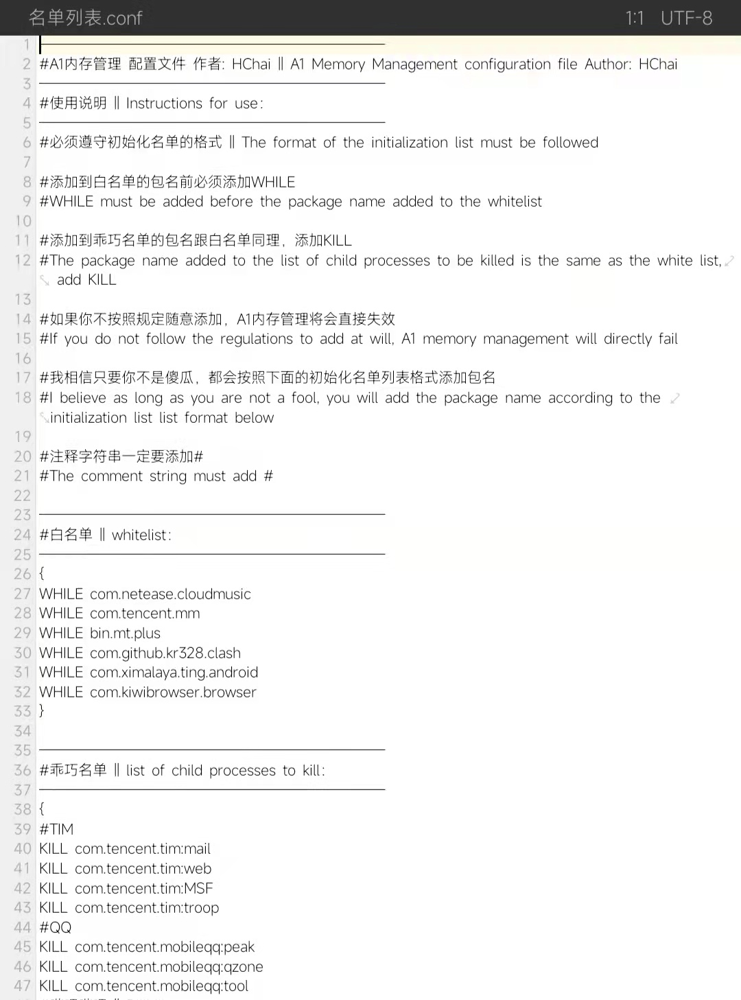

# A1内存管理

[](http://cppmicroservices.org/)
[](http://cppmicroservices.org/)
[](https://www.python.org/)


[](https://t.me/HCha1234)

运行在Android的第三方内存管理，可减少应用使用运行内存。

**说明**

[English](README.md) | [中文](README-zh.md)

## 重要功能
- 管理后台进程存活和死亡
- 指定释放后台应用子进程
- 阻止Low Memory Killer Daemon杀后台
- 自动释放非常用内存
- 让应用休眠减少CPU和内存使用

## 说明
- 该模块只支持Android8 ~ 13，平台仅支持arm64-v8a
- Magisk不低于20.4+，ksu大部分可兼容
- 该模块不会与其他模块产生任何冲突

### 默认列表路径

- 名单列表：/sdcard/Android/HChai/HC_memory/名单列表.conf

## 自定义配置
自带配置适用于绝大多数设备，但还是有一些设备不适用默认配置，因此开放更多内置可调参数。在设计HAMv2框架时遍已经考虑到该需求，绝大多数的参数都可自定义调整，而且此项目可嵌入到其他模块中运行。Json配置文件位于['/data/adb/modules/Hc_memory/config/memory.json']

### 项目信息
```json
"project": {
    "name": "官方配置 [23.06.25]",
    "author": "火機@coolapk"
}
```

| 字段名   | 类型 | 描述                                           |
| -------- | -------- | ---------------------------------------------- |
| name     | string   | 配置文件的名称                                 |
| author   | string   | 配置文件的作者信息                             |

`name`与`author`在日志以如下方式体现：  
```
[2023-07-06 19:00:22] [info] config 官方配置 [23.06.25] | by: 火機@coolapk
```

## 常见问题
Q: 可以搭配其他内存优化模块吗？
A: A1内存管理与其他内存优化原理完全不同，因此搭配其他模块效果只会是1+1=2。

Q: 是否会耗电？
A: 完全不会。我在开发HAMv2框架时，花费了大量时间来优化核心代码，并采用了底层的C/C++语言。因此，该框架所造成的耗电量微乎其微，可以忽略不计。

Q: 与其他Magisk模块或者Xp模块会造成冲突吗？
A: 几乎不太可能与其他模块发生冲突，至今尚未遇到与本模块发生冲突的情况。

Q: 是否造成待机耗电？
A: HAMv2框架不会导致待机耗电，因为在待机状态下，A1内存管理会进入休眠状态。

Q: 启用阻止lmkd杀后台，为什么后台还是被杀了？
A: 因为只阻止lmkd杀后台，不包含各个手机厂商的杀后台程序。

Q: 如何配置乖巧列表？
A: 要配置乖巧列表，你需要在相应的列表中添加"KILL 包名:子进程名"的规则。在添加之前，你需要确保了解子进程的功能和作用，以免造成意外问题。

Q: 遇到了一些奇怪的问题，如何解决？
Q: 为什么进入系统一段时间后进入fb模式？
A: 出现该问题的大部分都是三星手机，并且启用了hook阻止lmkd杀进程的功能，这可能是导致的原因。目前尚无法解决这个问题，但可以通过关闭阻止lmkd杀进程的功能来解决。
Q: 为什么播放音频的进程被暂停了？
A: 音频进程被暂停的情况很少发生，如果确实发生了，可以将该进程添加到白名单中，或者关闭应用休眠功能。这样可以确保音频进程持续运行而不被暂停。

Q: 安装模块时提示Not compatible with this platform: xxxx
A: 目前模块仅支持arm-v8a平台，其他平台暂时不支持。

## 致谢

感谢以下用户或项目的源码对本项目的帮助：  
- [@yc9559](https://github.com/yc9559)
- [@HChenX](https://github.com/HChenX)

感谢以下用户的测试反馈和错误定位：
- @火機(coolapk)

## 捐赠支持
如何你觉得这个模块很好用，可以捐赠来支持我
- [爱发电](https://afdian.net/a/HCha1)
- [patreon](https://patreon.com/A1memory)
- USDT(TRC20)
  > 地址: TSqTqn2NcyUAbEwsdGgsrYoU5pokno5PnQ
